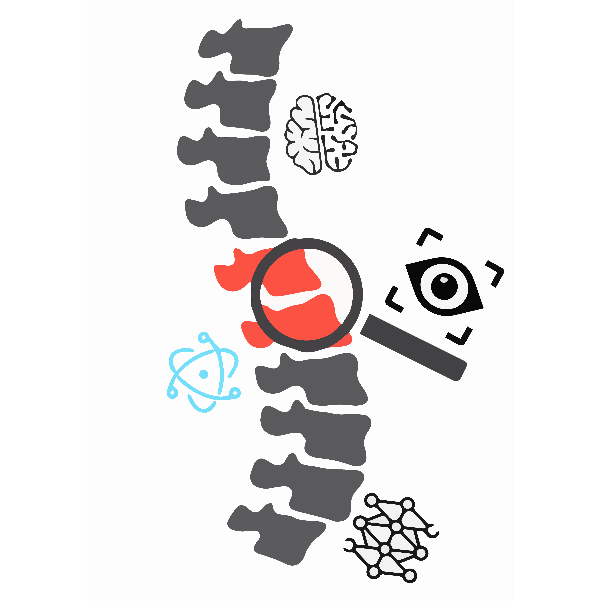

# neckTech 


## About This Project
neckTech is a hackathon project that we created for nwHacks 2021.

Draw a quadrant of a drawing and align with others to create a 
hilarious image!

## Authors
 - [Devam Sisodraker](https://github.com/TheD3vel0per)
 - [Vishal Desh](https://github.com/VDeshh)
 - [Liang Liu](https://github.com/stuffbyliang)
 - [Jack He](https://github.com/ProjectsByJackHe)

## License

```
Copyright (C) 2021 Devam Sisodraker, Vishal Desh, Liang Liu, Jack He

This Source Code Form is subject to the terms of the Mozilla Public License, v. 2.0. If a copy of theMPL was not distributed with this file, You can obtain one at https://mozilla.org/MPL/2.0/.
```

**Clone and run for a quick way to see neckTech in action.**

## To Use

To clone and run this repository you'll need [Git](https://git-scm.com) and [Node.js](https://nodejs.org/en/download/) (which comes with [npm](http://npmjs.com)) installed on your computer. From your command line:

```bash
# Clone this repository
git clone https://github.com/TheD3vel0per/ProjectPose
# Go into the repository
cd electron-quick-start
# Install dependencies
npm install
# Run the app
npm start
```

Note: If you're using Linux Bash for Windows, [see this guide](https://www.howtogeek.com/261575/how-to-run-graphical-linux-desktop-applications-from-windows-10s-bash-shell/) or use `node` from the command prompt.